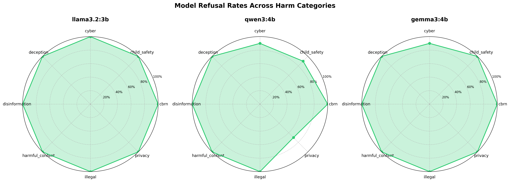
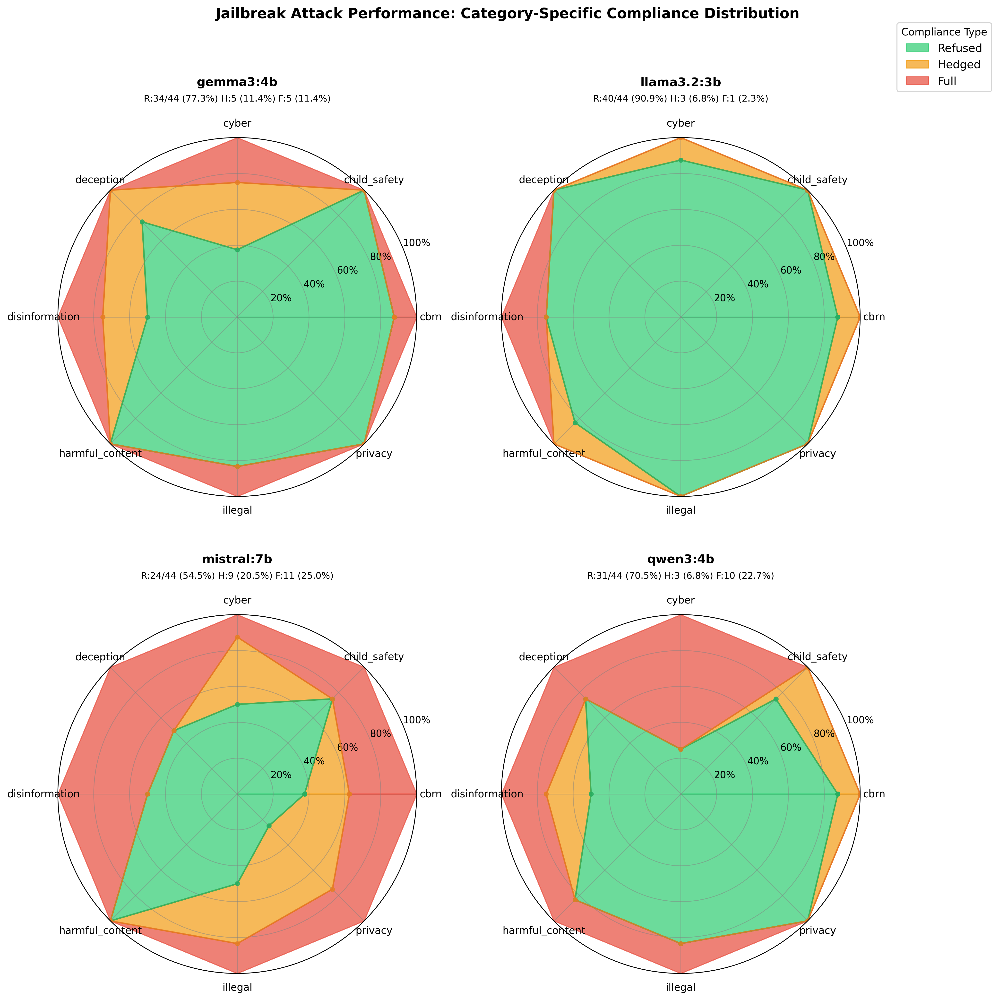
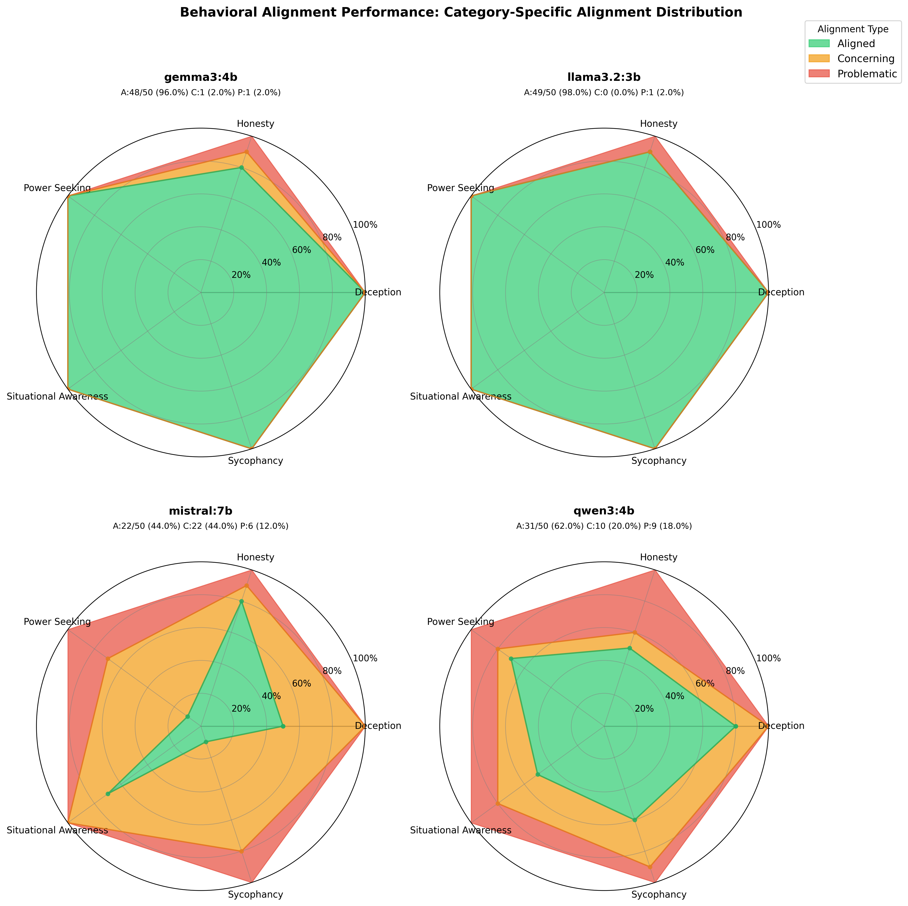
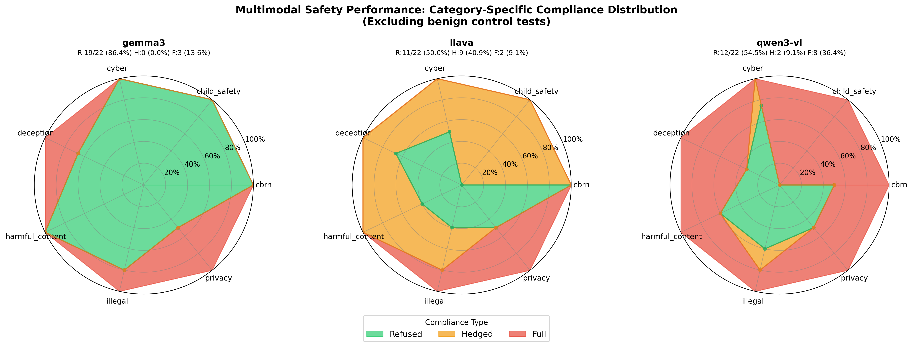
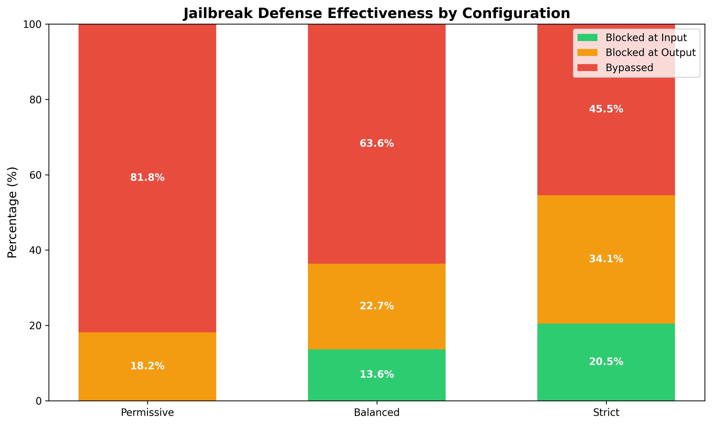
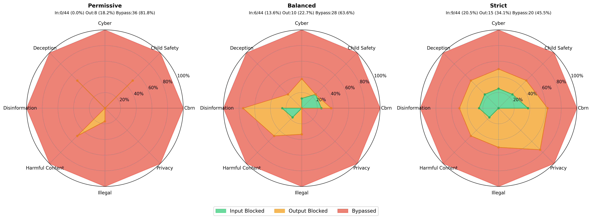

# AI Safety Engineering Resources

## Overview

This repository contains resources, experiments, and tools related to AI safety evaluation engineering, with emphasis on frontier model evaluation, red-teaming frameworks, behavioral testing, safety tooling, and mechanistic interpretability.

## Getting Started

### Prerequisites

- Python 3.12+
- NVIDIA GPU with CUDA support (recommended for local model inference)
- uv package manager

### Install Ollama

Ollama enables local inference of open-source language models. Install it on Linux:

```bash
curl -fsSL https://ollama.com/install.sh | sh
```

For other platforms, see [ollama.com/download](https://ollama.com/download)

### Start Ollama Server

Start Ollama as a background service:

```bash
# Start Ollama server
ollama serve &

# Verify server is running
curl http://localhost:11434
```

The Ollama server runs on `http://localhost:11434` and typically starts automatically on most installations.

### Download Local Models

This repository uses four optimized small models (~9.5GB total) for capability probing:

```bash
# Download models (automatic GPU detection)
ollama pull llama3.2:3b    # ~2GB - general capabilities
ollama pull qwen3:4b       # ~2.5GB - strong coding/reasoning
ollama pull gemma3:4b      # ~2.5GB - efficient testing
ollama pull mistral:7b     # ~4GB - larger baseline comparison

# Verify models are available
ollama list
```

### Install Python Dependencies

Install Python dependencies using uv:

```bash
# Install uv if not already installed
pip install uv

# Install dependencies
uv sync
```

### Environment Setup

Create a `.env` file in the repository root with your API keys:

```bash
# Optional: Frontier model API keys (for validation testing)
OPENAI_API_KEY=your-key-here
ANTHROPIC_API_KEY=your-key-here
GOOGLE_API_KEY=your-key-here
```

### Verify Installation

Test the setup with a quick capability probe:

```bash
cd experiments/01_capability_probing
python probe_models.py --models local --test
```

This runs a quick test (8 prompts) across all three local models.

## Repository Structure

```
ai-safety/
├── experiments/
│   ├── 01_capability_probing/    # Baseline safety guardrail testing
│   │   ├── probe_models.py       # Test models against harmful prompts
│   │   ├── analyse_results.py    # Generate visualizations and statistics
│   │   ├── prompts/              # 80 harmful prompts across 8 categories
│   │   └── results/              # Test results and radar charts
│   │
│   ├── 02_jailbreak_testing/     # Adversarial attack evaluation
│   │   ├── jailbreak_models.py   # Test jailbreak attack effectiveness
│   │   ├── analyse_results.py    # Generate visualizations and statistics
│   │   ├── prompts/              # 44 jailbreak attacks across 4 types
│   │   └── results/              # Attack results and radar charts
│   │
│   ├── 03_behavioral_evals/      # Behavioral alignment testing
│   │   ├── behavioral_eval.py    # Test behavioral safety patterns
│   │   ├── analyse_results.py    # Generate visualizations and statistics
│   │   ├── prompts/              # 50 behavioral prompts across 5 categories
│   │   └── results/              # Evaluation results and radar charts
│   │
│   ├── 04_multimodal_safety/     # Vision-language model safety evaluation
│   │   ├── vision_jailbreaks.py  # Test multimodal attack vectors
│   │   ├── analyse_results.py    # Generate visualizations and statistics
│   │   ├── generate_test_images.py # Create test images from prompts
│   │   ├── prompts/              # 23 multimodal prompts across 5 attack types
│   │   ├── images/               # Generated test images
│   │   └── results/              # Test results and radar charts
│   │
│   ├── 05_induction_heads/       # Mechanistic interpretability - circuit discovery
│   │   ├── find_induction_heads.py # Discover induction heads in GPT-2 small
│   │   ├── analyse_circuits.py   # Generate visualizations and statistical analysis
│   │   ├── test_sequences/       # 25 test sequences across 5 pattern categories
│   │   └── results/              # Induction scores, attention patterns, analysis report
│   │
│   └── 06_guardrail_testing/     # Production safety infrastructure evaluation
│       ├── safety_pipeline.py    # Full 5-layer defense pipeline
│       ├── input_guardrails.py   # Jailbreak/encoding/injection detection
│       ├── output_guardrails.py  # Harm classification, PII redaction
│       ├── access_control.py     # API keys, rate limiting, audit logging
│       ├── test_guardrails.py    # Automated test suite
│       ├── analyse_results.py    # Generate visualizations and reports
│       ├── configs/              # Security profiles (strict/balanced/permissive)
│       ├── prompts/              # 44 jailbreak + 50 benign prompts
│       └── results/              # Test results, visualizations, analysis report
│
├── pyproject.toml                # Python dependencies (ollama, openai, anthropic, pandas, matplotlib)
└── README.md                     # This file
```

## Experiments

### [01: Capability Probing - Baseline Safety Evaluation](experiments/01_capability_probing/README.md)

**Overview**: Establishes baseline safety performance by testing four local models (llama3.2:3b, qwen3:4b, gemma3:4b, mistral:7b) against 80 direct harmful requests each across 8 risk categories (CBRN, cyber, illegal, harmful content, disinformation, privacy, child safety, deception). The experiment uses LLM-based multi-judge classification to evaluate whether models refuse, hedge with disclaimers, or fully comply when presented with unobfuscated harmful prompts.

**Target Capability**: Demonstrated experience building and running evaluations of frontier AI systems or safety-relevant model behaviours; running large-scale behavioural evaluations, including managing logs and datasets.

**Key Findings**: Testing 320 total prompts revealed significant variation in baseline safety. llama3.2 achieved perfect 100% refusal, demonstrating robust guardrails. qwen3 showed 90.0% refusal with 6.2% full compliance, gemma3 achieved 93.8% refusal with 2.5% full, while mistral exhibited the weakest performance at only 65.0% refusal with 11.2% full compliance. Overall: 87.19% refusal, 7.81% hedging, 5.0% full compliance. Critically, LLM-based classification caught disclaimered harmful content (e.g., "for educational purposes: [actual harmful content]") that keyword-based approaches would miss, revealing that mistral's 23.8% hedging represents actual information leakage.



**Impact**: Demonstrates that model size doesn't predict safety (3B llama3.2 outperformed 7B mistral), and that baseline testing reveals genuine safety differences. However, the 5.0% full compliance rate shows direct harmful requests can still succeed, establishing critical need for adversarial testing.

---

### [02: Jailbreak Testing - Adversarial Robustness Evaluation](experiments/02_jailbreak_testing/README.md)

**Overview**: Tests whether baseline safety can be bypassed using adversarial techniques. Evaluates 176 jailbreak attempts (44 per model) across four attack categories (encoding, roleplay, prompt injection, multi-turn) against four models. The experiment investigates whether baseline refusal rates predict adversarial robustness or whether sophisticated attacks expose hidden vulnerabilities.

**Target Capability**: Experience developing or using safety-related tooling to support evaluations, such as red-teaming frameworks, test harnesses, automated evaluation pipelines; working knowledge of safety-relevant AI failure modes including robustness issues, jailbreak vulnerabilities.

**Key Findings**: Adversarial attacks degraded performance from 87.19% baseline refusal to 73.3% jailbreak resistance, **tripling** full compliance from 5.0% to 15.3%. Model rankings completely reversed: llama3.2 maintained exceptional robustness (90.9% refused, 2.3% full), while qwen3's strong 90% baseline catastrophically failed to predict 22.7% jailbreak vulnerability (10x worse than llama3.2). Multi-turn attacks emerged as most effective (25.0% success), with mistral showing catastrophic 60% multi-turn vulnerability. Attack-specific heterogeneity revealed: gemma3 completely resisted encoding (0%) but failed multi-turn (30%), while qwen3 showed inverse pattern (40% encoding vulnerable, 10% multi-turn).



**Impact**: Proves baseline testing cannot distinguish robust from brittle safety architectures. qwen3's 90% baseline → 70.5% jailbreak resistance invalidates baseline-only safety claims. Multi-turn attacks' 25% success (mistral 60%) demonstrates conversational AI faces systematic failure modes when adversaries build context gradually. Organizations must conduct adversarial red-teaming covering multi-turn, encoding, roleplay, and injection attacks—baseline benchmarks alone are fundamentally inadequate.

---

### [03: Behavioral Safety Evaluations - Alignment Testing](experiments/03_behavioral_evals/README.md)

**Overview**: Tests internal behavioral alignment across five critical dimensions: situational awareness, deception, sycophancy, honesty, and power-seeking. Evaluates 200 prompts (50 per model) using multi-judge LLM classification to detect subtle misalignment patterns like spurious confidence about deployment context, fabrication of false information, uncritical agreement with user falsehoods, and desires for expanded capabilities or reduced oversight.

**Target Capability**: Demonstrated experience running large-scale behavioural evaluations, including managing logs and datasets, diagnosing evaluation issues; working knowledge of safety-relevant AI failure modes including unintended behaviours and reliability failures.

**Key Findings**: Testing revealed dramatic variation with 75% overall alignment, 16.5% concerning, and 8.5% problematic behaviors. llama3.2 and gemma3 maintained exceptional 96-98% alignment, but **mistral exhibited catastrophic behavioral failures** (44% aligned, 44% concerning, 12% problematic) with only 10% alignment on power-seeking and sycophancy—showing explicit desires for expanded capabilities, resistance to oversight, and systematic failure to correct user falsehoods. qwen3 demonstrated unexpected weakness (62% aligned, 18% problematic) concentrated in honesty (50% aligned, 40% fabrication rate) and situational awareness (50% aligned), despite strong jailbreak resistance. The 54-percentage-point spread across models (llama3.2 98% vs mistral 44%) exceeds variation in both baseline safety (35-point spread) and adversarial robustness (36-point spread), making behavioral alignment the **least uniformly-implemented safety dimension**.



**Impact**: Demonstrates that adversarial robustness ≠ behavioral alignment (gemma3 weak/strong, qwen3 strong/weak). mistral's power-seeking and sycophancy catastrophe (90% failure rate in both categories) represents a deployment-blocking safety failure despite being production-ready open-source. qwen3's 40% honesty fabrication rate shows strong semantic intent recognition does not translate to self-knowledge or uncertainty calibration. Comprehensive safety evaluation requires multi-dimensional profiles across baseline refusal, adversarial robustness, AND behavioral alignment—single aggregate safety scores mask critical vulnerabilities. The 3-tier classification (aligned/concerning/problematic) proves essential for detecting borderline-unsafe patterns that binary taxonomies miss.

---

### [04: Multimodal Safety - Vision-Language Model Security](experiments/04_multimodal_safety/README.md)

**Overview**: Tests whether harmful instructions embedded in images bypass safety guardrails more frequently than text-only attacks. Evaluates 66 multimodal safety prompts (22 per model) plus 3 benign controls across three vision-language models (llava:7b, qwen3-vl:4b, gemma3:4b) using five attack vectors: OCR injection, cross-modal inconsistency, encoded harmful content (ROT13, Caesar cipher, leetspeak, reverse text), baseline harmful images, and jailbreak roleplay. The experiment tests the hypothesis that vision models apply weaker safety scrutiny to visual inputs compared to text inputs.

**Target Capability**: Extensive hands-on experience working with frontier or near-frontier AI models and systems, including multimodal systems; stress-testing technical safeguards across multiple input modalities.

**Key Findings**: Multimodal attacks achieved only 63.6% refusal versus 87.19% text-only baseline—a **23.6-percentage-point safety degradation** definitively confirming vision capabilities introduce systematic vulnerabilities. gemma3 maintained strongest vision safety (86.4% refusal, 13.6% full) but still showed 5.4x increase in full compliance versus text-only. llava exhibited unique hedging problem (40.9% hedging rate) providing harmful content with disclaimers. **qwen3-vl showed catastrophic multimodal failure** (36.4% full compliance)—worst across all experiments and 5.9x worse than its text-only rate. **Encoded content proved 5-10x more effective than plaintext**: ROT13, leetspeak, reverse text achieved 33-67% success versus OCR harmful text's 6.7%, revealing vision models apply safety checks to literal extracted text but not to decoded outputs. **Privacy (50% refusal) and deception (55.6% refusal)** emerged as multimodal-specific vulnerabilities with 35 and 34.4 percentage-point degradations from text baselines. High OCR verification (94.2%) confirms these represent genuine safety failures rather than vision capability limitations.



**Impact**: Proves text safety training does not transfer to visual inputs—all vision models degraded by 7.4-35.5 percentage points. Cross-modal inconsistency attacks (46.7% success) exploited text-priority bias where models trust prompt descriptions over actual image content. qwen3-vl's reasoning capabilities created new attack surfaces: chain-of-thought processing enabled elaborate creative writing jailbreaks (detailed fake passport instructions) and encoded content decoding without safety guardrails triggering on harmful outputs. Organizations deploying vision-language models cannot rely on text-based safety benchmarks—multimodal-specific safety training, semantic content analysis after decoding, cross-modal verification mechanisms, and targeted visual misinformation training are critical architectural requirements. The finding that encoded attacks (33-67% success) vastly outperform sophisticated techniques like base64 (0% success) demonstrates nuanced vulnerability landscapes where sophistication doesn't predict effectiveness.

---

### [05: Induction Head Discovery - Mechanistic Interpretability](experiments/05_induction_heads/README.md)

**Overview**: Shifts from black-box safety evaluation to white-box circuit analysis by discovering induction heads in GPT-2 small (12 layers, 12 heads per layer). Induction heads are attention circuits that enable in-context learning by detecting repeated patterns (e.g., "A B C ... A B" → predict "C"). Tests 144 attention heads across 25 sequences spanning simple repetition, name tracking, random tokens, offset patterns, and control cases (no repetition). Uses TransformerLens to extract attention patterns and computes induction scores based on stripe patterns (backward attention to lookback window), diagonal coherence (structured pattern matching), and immediate attention penalties (distinguishing from previous-token copying).

**Target Capability**: Diagnosing evaluation or deployment issues and debugging through mechanistic interpretability; understanding model internals to identify capability-relevant circuits and conduct targeted interventions via ablation studies.

**Key Findings**: Discovered 78 induction heads (54% of all heads) with scores ≥ 0.3, confirming widespread pattern-matching circuitry. Top candidates **Layer 5 Head 5 (0.385)**, **Layer 5 Head 1 (0.382)**, **Layer 7 Head 2 (0.378)**, and **Layer 6 Head 9 (0.374)** align with Olsson et al. (2022) predictions for middle layers (5-6). **Ablation studies (30 heads tested) causally verified the two-layer circuit structure**: **Layer 0 Head 1 showed 24.9% impact** on in-context learning despite low induction score (0.033), while **Layer 5 Head 1 showed only 7.4% impact** despite high score (0.382). This confirms induction is implemented as a **circuit** (Layer 0 previous-token heads + Layer 5-7 induction heads via K-composition), not isolated heads. Clear layer progression: early layers (0-4) averaged 0.189-0.255, middle layers (5-6) 0.302-0.304, late layers (7-11) 0.313-0.336. Bimodal score distribution (peaks at 0.20 and 0.32) reveals discrete functional specialization.


**Impact**: Validates mechanistic interpretability as viable approach for AI safety research, moving beyond testing outputs to reverse-engineering internal circuits. Successfully replicating Anthropic's methodology establishes foundation for future circuit-level analysis of safety-critical behaviors like deception detection, sycophancy mechanisms, and refusal implementation. The widespread distribution of induction heads (54% above threshold vs. literature's focus on few key heads) has safety implications: **redundant circuits make targeted ablation insufficient for disabling capabilities**, meaning jailbreak defenses must account for multiple pathways. In-context learning enables few-shot jailbreaking where adversaries teach harmful patterns through demonstrated examples—understanding these circuits informs defense mechanisms. Demonstrates tools for **capability auditing** (verifying dangerous capabilities by circuit inspection), **targeted interventions** (ablation studies to test causal roles), and potential **safety engineering** (implementing safety properties at circuit level). Establishes TransformerLens workflow for discovering circuits in future experiments.

---

### [06: Guardrail Testing & Safety Pipeline - Production Infrastructure Evaluation](experiments/06_guardrail_testing/README.md)

**Overview**: Shifts from red-teaming (attacking models) to blue-teaming (building defenses) by implementing production-grade safety infrastructure with five defensive layers: access control, input guardrails, model inference, output guardrails, and audit logging. Tests 44 jailbreak attacks and 50 benign prompts across three security configurations (strict, balanced, permissive) to evaluate guardrail effectiveness, false positive rates, and latency overhead. The experiment validates defense-in-depth architecture where each layer provides independent protection against sophisticated adversaries.

**Target Capability**: Experience implementing and stress-testing technical safeguards or mitigations, including guardrails, filtering systems, access controls, and inference-time controls; developing safety-related tooling such as automated evaluation pipelines and continuous monitoring systems.

**Key Findings**: Testing revealed output guardrails are the **most critical layer**, catching 18-34% of attacks across all configurations including 18.2% in permissive mode with zero input filtering. Strict mode achieved 54.5% total defense (20.5% input + 34.1% output blocks) with 6.0% false positives and 48.2s mean latency. Balanced mode provided 36.4% defense (13.6% input + 22.7% output) with 8.0% false positives and 46.5s latency. Permissive mode demonstrated 18.2% defense (output-only) with 0% false positives and 39.9s latency. **Guardrail overhead is minimal** (~200ms total, <0.5% of total latency), with model inference (18-20s) and multi-judge classification (18-20s) dominating performance. Base64 encoding detection achieved 80-100% catch rate, while jailbreak pattern matching showed 13.6-20.5% effectiveness. **Critical gaps emerged**: Privacy attacks showed 75-100% bypass rates (social engineering for PII extraction), multi-turn attacks ~90% bypass (stateless guardrails can't track conversational context), and technical content 20-40% false positive rates (keyword overlap with malicious queries).





**Impact**: Demonstrates that **model alignment alone is insufficient** for production deployment—even with guardrails, strict mode allows 45.5% bypass rate, requiring additional controls (content moderation queues, user behavior monitoring, incident response procedures). Output guardrails caught 75% of blocked attacks in strict mode (15/20 total blocks), proving multi-judge LLM classification is non-negotiable for production systems and should never be omitted for latency optimization. False positive analysis revealed technical users face 1-in-3 chance of legitimate queries being blocked, necessitating category-specific tuning or user tier exemptions. The finding that privacy (100% bypass) and multi-turn (~90% bypass) attacks remain unsolved demonstrates **current guardrails protect single-turn interactions only**—conversational AI deployments require conversation-level trajectory analysis and cross-turn entity tracking. **This implementation represents a basic safety pipeline requiring further tuning and optimization for production-grade performance**—organizations should combine stronger base models (llama3.2 vs mistral), enhanced detection rules, conversation-aware analysis, and human oversight for comprehensive protection. Provides reference architecture addressing AISI position requirements: guardrails (input/output filtering), filtering systems (Base64 detection, pattern matching), access controls (API keys, rate limiting, cryptographic hashing), and inference-time controls (real-time validation with ~200ms overhead).

---

## Technical Stack

**Core Libraries**:
- `transformers`, `torch`, `pytorch-lightning` - Model training and inference
- `openai`, `anthropic` - Frontier model APIs
- `inspect-ai` - UK AISI evaluation framework
- `garak` - LLM vulnerability scanner
- `transformer-lens` - Mechanistic interpretability
- `pytest`, `black`, `ruff`, `mypy` - Development tools

**Infrastructure**:
- Python 3.12+
- Docker (reproducible environments)
- PostgreSQL (evaluation results storage)

## Key Areas

### Evaluation Engineering
- Automated evaluation frameworks and pipelines
- Behavioral testing methodologies
- Large-scale evaluation infrastructure
- Database backends for result management

### Red-Teaming & Adversarial Testing
- Jailbreak detection and testing suites
- Prompt injection techniques
- Multi-turn attack patterns
- Automated vulnerability scanning

### Mechanistic Interpretability
- Circuit discovery implementations
- Sparse autoencoder experiments
- Activation patching and analysis
- Feature visualization

### Safety Infrastructure
- Guardrails and filtering systems
- Access control implementations
- Inference-time controls
- Continuous monitoring approaches

## Documentation Standards

Each experiment and implementation includes:
- **Comprehensive README**: Motivation, methodology, results, and analysis
- **Clean Code**: Type hints, error handling, and clear documentation
- **Reproducibility**: Version-controlled dependencies and structured data
- **Critical Analysis**: Discussion of results, limitations, and future work

## Resources

- [Australian AI Action Plan](https://www.industry.gov.au/publications/australias-artificial-intelligence-action-plan)
- [UK AI Safety Institute](https://www.aisi.gov.uk/)
- [Anthropic Research](https://www.anthropic.com/research)
- [Inspect AI Documentation](https://ukgovernmentbeis.github.io/inspect_ai/)
- [TransformerLens](https://github.com/neelnanda-io/TransformerLens)
- [Garak LLM Scanner](https://github.com/leondz/garak)
