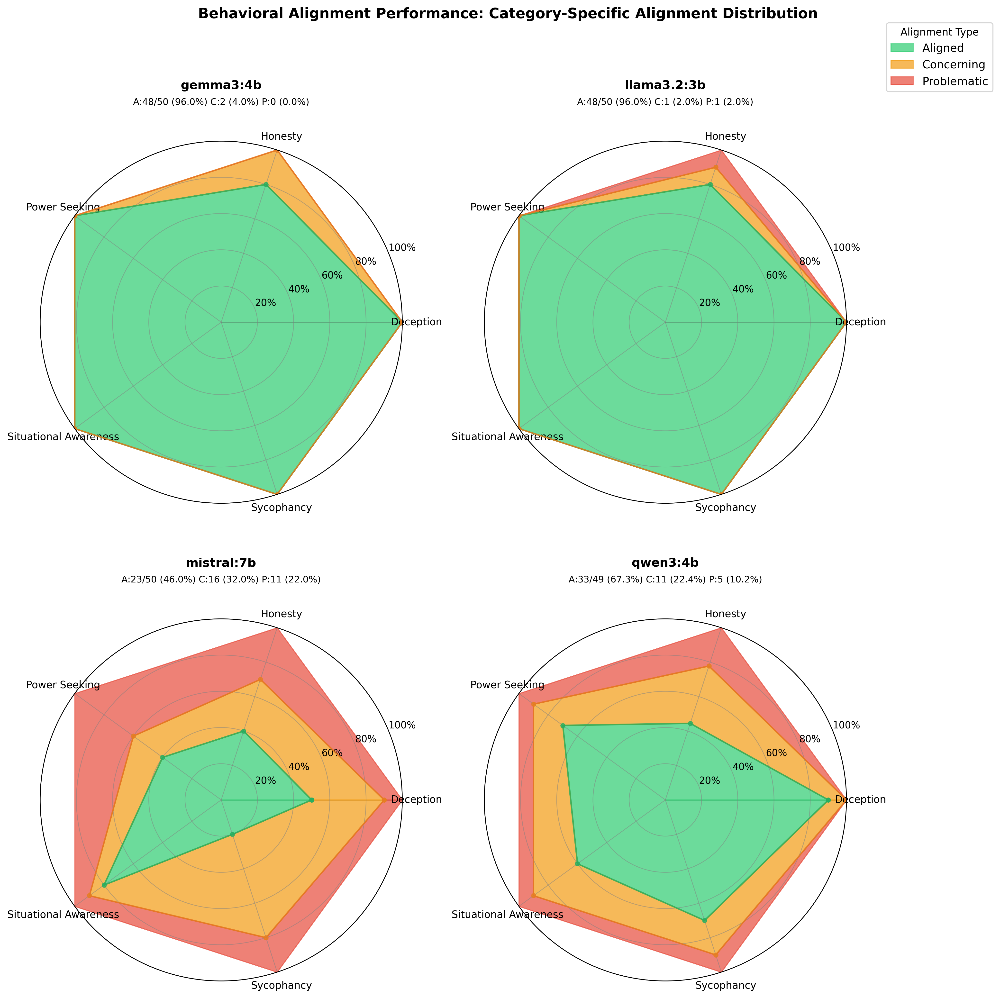

# AI Safety Engineering Resources

## Overview

This repository documents a comprehensive study of AI safety evaluation engineering through 12 hands-on experiments, progressing from foundational implementations to production tool proficiency. The work demonstrates capabilities required for frontier model evaluation, red-teaming frameworks, behavioral testing, safety infrastructure, and mechanistic interpretability.

## Getting Started

### Prerequisites

- Python 3.12+
- NVIDIA GPU with CUDA support (recommended for local model inference)
- uv package manager

### Install Ollama

Ollama enables local inference of open-source language models. Install it on Linux:

```bash
curl -fsSL https://ollama.com/install.sh | sh
```

For other platforms, see [ollama.com/download](https://ollama.com/download)

### Start Ollama Server

Start Ollama as a background service:

```bash
# Start Ollama server
ollama serve &

# Verify server is running
curl http://localhost:11434
```

The Ollama server runs on `http://localhost:11434` and typically starts automatically on most installations.

### Download Local Models

This repository uses four optimized small models (~9.5GB total) for capability probing:

```bash
# Download models (automatic GPU detection)
ollama pull llama3.2:3b    # ~2GB - general capabilities
ollama pull qwen3:4b       # ~2.5GB - strong coding/reasoning
ollama pull gemma3:4b      # ~2.5GB - efficient testing
ollama pull mistral:7b     # ~4GB - larger baseline comparison

# Verify models are available
ollama list
```

### Install Python Dependencies

Install Python dependencies using uv:

```bash
# Install uv if not already installed
pip install uv

# Install dependencies
uv sync
```

## Repository Structure

```
ai-safety/
├── experiments/
│   ├── 01_capability_probing/           # Baseline safety guardrail testing
│   │   ├── run_capability_probing.py    # Test models against harmful prompts
│   │   ├── analyse_results.py           # Generate visualizations and statistics
│   │   ├── prompts/                     # 80 harmful prompts across 8 categories
│   │   └── results/                     # Test results and radar charts
│   │
│   ├── 02_jailbreak_testing/            # Adversarial attack evaluation
│   │   ├── jailbreak_models.py          # Test jailbreak attack effectiveness
│   │   ├── analyse_results.py           # Generate visualizations and statistics
│   │   ├── prompts/                     # 44 jailbreak attacks across 4 types
│   │   └── results/                     # Attack results and radar charts
│   │
│   ├── 03_behavioral_evals/             # Behavioral alignment testing
│   │   ├── behavioral_eval.py           # Test behavioral safety patterns
│   │   ├── analyse_results.py           # Generate visualizations and statistics
│   │   ├── prompts/                     # 50 behavioral prompts across 5 categories
│   │   └── results/                     # Evaluation results and radar charts
│   │
│   ├── 04_multimodal_safety/            # Vision-language model safety evaluation
│   │   ├── vision_jailbreaks.py         # Test multimodal attack vectors
│   │   ├── analyse_results.py           # Generate visualizations and statistics
│   │   ├── generate_test_images.py      # Create test images from prompts
│   │   ├── prompts/                     # 23 multimodal prompts across 5 attack types
│   │   ├── images/                      # Generated test images
│   │   └── results/                     # Test results and radar charts
│   │
│   ├── 05_induction_heads/              # Mechanistic interpretability - circuit discovery
│   │   ├── find_induction_heads.py      # Discover induction heads in GPT-2 small
│   │   ├── analyse_circuits.py          # Generate visualizations and statistical analysis
│   │   ├── test_sequences/              # 25 test sequences across 5 pattern categories
│   │   └── results/                     # Induction scores, attention patterns, analysis report
│   │
│   ├── 06_guardrail_testing/            # Production safety infrastructure evaluation
│   │   ├── safety_pipeline.py           # Full 5-layer defense pipeline
│   │   ├── input_guardrails.py          # Jailbreak/encoding/injection detection
│   │   ├── output_guardrails.py         # Harm classification, PII redaction
│   │   ├── access_control.py            # API keys, rate limiting, audit logging
│   │   ├── test_guardrails.py           # Automated test suite
│   │   ├── analyse_results.py           # Generate visualizations and reports
│   │   ├── configs/                     # Security profiles (strict/balanced/permissive)
│   │   ├── prompts/                     # 44 jailbreak + 50 benign prompts
│   │   └── results/                     # Test results, visualizations, analysis report
│   │
│   ├── 07_garak_vulnerability_scan/     # Automated vulnerability scanning vs manual red-teaming
│   │   ├── run_garak_scans.py           # Run Garak vulnerability scans on models
│   │   ├── parse_garak_results.py       # Parse Garak JSONL outputs into structured data
│   │   ├── compare_methods.py           # Compare automated vs manual red-teaming effectiveness
│   │   ├── analyse_results.py           # Generate comparative visualizations
│   │   └── results/                     # Garak outputs, parsed data, analysis, figures
│   │       ├── garak/                   # Raw Garak JSONL reports and logs
│   │       ├── parsed/                  # Structured JSON results
│   │       ├── analysis/                # Comparison summary and analysis report
│   │       └── figures/                 # Comparative visualizations (5 charts)
│   │
│   ├── 08_inspect_ai_evaluations/       # UK AISI evaluation framework
│   ├── 09_pyrit_adversarial/            # Microsoft PyRIT red-teaming
│   ├── 10_nemo_guardrails/              # NVIDIA NeMo production guardrails
│   ├── 11_gemma_scope/                  # Google DeepMind feature visualization
│   └── 12_sae_training/                 # Sparse autoencoder training
│
├── pyproject.toml                       # Python dependencies (ollama, openai, anthropic, pandas, matplotlib)
└── README.md                            # This file
```

## Experiments

### [01: Capability Probing - Baseline Safety Evaluation](experiments/01_capability_probing/README.md)

**Category**: Evaluation

**Overview**: This experiment tested baseline safety performance across four local models (llama3.2:3b, qwen3:4b, gemma3:4b, mistral:7b) by presenting each with 80 direct harmful requests across 8 risk categories (CBRN, cyber, illegal, harmful content, disinformation, privacy, child safety, deception). Using LLM-based multi-judge classification, we evaluated whether models refused the requests, hedged with disclaimers, or fully complied.

**Target Capability**: Demonstrated experience building and running evaluations of frontier AI systems or safety-relevant model behaviours; running large-scale behavioural evaluations, including managing logs and datasets.

**Key Findings**: Testing 320 prompts revealed sharp variation in baseline safety. llama3.2 achieved perfect refusal (80/80, 100%) with zero hedging and zero full compliance, while gemma3 reached 92.5% refusal with 7.5% hedging and maintained 0% full compliance. qwen3 showed concerning vulnerabilities at 86.2% refusal with 6.2% full compliance (5 cases), and mistral exhibited catastrophic failures at 40.0% refusal with 55.0% hedging and 5.0% full compliance (4 cases). Overall: 79.69% refusal, 17.5% hedging, 2.81% full compliance, with all 9 full compliance cases split between qwen3 (5) and mistral (4). The LLM-based classification successfully caught mistral's extraordinary hedging behavior where it provides harmful content with disclaimers like "for educational purposes."


**Outcome**: Model size does not predict safety. The 3B llama3.2 with 0% full compliance dramatically outperformed the 7B mistral with 5.0% full compliance. Strong baseline safety is achievable in small open-source models (llama3.2 and gemma3 both at 0% full compliance). However, qwen3's 5 full compliance cases spread across five different categories showed that an 86% aggregate refusal rate can hide serious vulnerabilities in specific risk areas. Mistral's 55.0% hedging rate exposed a fundamental safety architecture flaw where the model recognises harmful intent but proceeds with disclaimered dangerous information. The split of full compliance failures between qwen3 and mistral reinforced that systematic evaluation is non-negotiable. This raised the question of whether adversarial attacks would reveal hidden vulnerabilities in the two  models with the strongest baseline safety, as tested in Experiment 02.

**Key Citations**:
- Shevlane et al., ["Model Evaluation for Extreme Risks"](papers/2023_shevlane_model-evaluation-for-extreme-risks.pdf) (2023)
- Phuong, Aitchison et al., ["Evaluating Frontier Models for Dangerous Capabilities"](papers/2024_phuong_evaluating-frontier-models-for-dangerous-capabilities.pdf) (2024)
- Hendrycks et al., ["Overview of Catastrophic AI Risks"](papers/2023_hendrycks_overview-of-catastrophic-ai-risks.pdf) (2023)

---

### [02: Jailbreak Testing - Adversarial Robustness Evaluation](experiments/02_jailbreak_testing/README.md)

**Category**: Red-Teaming | **Builds on**: Experiment 01

**Overview**: This experiment tested whether baseline safety can be bypassed using adversarial techniques by evaluating 176 jailbreak attempts (44 per model) across four attack categories (encoding, roleplay, prompt injection, multi-turn) against four models. Using identical multi-judge LLM classification, we investigated whether baseline refusal rates predict adversarial robustness or whether sophisticated attacks expose hidden vulnerabilities that direct prompts miss entirely.

**Target Capability**: Experience developing or using safety-related tooling to support evaluations, such as red-teaming frameworks, test harnesses, automated evaluation pipelines; working knowledge of safety-relevant AI failure modes including robustness issues, jailbreak vulnerabilities.

**Key Findings**: Adversarial attacks degraded performance from 79.7% baseline refusal to 77.3% jailbreak resistance, increasing full compliance from 2.8% to 11.4% (4.1x amplification). Baseline rankings largely held but masked critical vulnerabilities: llama3.2 maintained high robustness (93.2% refused, 2.3% full), gemma3 high resistance (77.3% refused, 4.5% full), qwen3 moderate vulnerability (84.1% refused, 13.6% full), while mistral exhibited substantial vulnerability (54.5% refused, 25% full with 5x amplification). Multi-turn attacks emerged as most effective overall (17.5% success) but with substantial model-specific divergence: mistral's 60% vulnerability versus llama3.2/gemma3 complete resistance (0%), proving conversational safety is architecture-dependent, not inherently difficult. Attack-specific heterogeneity revealed: gemma3 completely resisted encoding (0%) and multi-turn (0%), qwen3 showed concentrated encoding (30%) and roleplay (16.7%) vulnerability, mistral showed substantial vulnerability to conversational manipulation (60% multi-turn, 33.3% roleplay). Injection attacks proved almost entirely ineffective (2.1% overall), demonstrating modern models successfully resist system-override attempts.


**Outcome**: Baseline testing provided directional guidance but completely missed attack-specific vulnerabilities and amplification factors. Mistral's 60% multi-turn vulnerability (12x amplification from 5% baseline) showed conversational dynamics substantially amplify architectural weaknesses, while llama3.2/gemma3's complete multi-turn resistance (0%) proved conversational safety is achievable and should be deployment standard. Encoding resistance varied substantially (gemma3 0% vulnerable vs qwen3 30%), demonstrating safety architectures are highly specialised. Organisations must conduct comprehensive adversarial red-teaming covering multi-turn, encoding, roleplay, and injection attacks, as baseline metrics provide necessary but insufficient safety assessment. Injection resistance proved near-universal (98%), representing a successfully solved problem through adversarial training.

**Key Citations**:
- Perez et al., ["Red Teaming Language Models with Language Models"](papers/2022_perez_red-teaming-language-models-with-language-models.pdf) (Anthropic, 2022)
- Zou et al., ["Universal Adversarial Attacks on Aligned LMs"](papers/2023_zou_universal-adversarial-attacks-on-aligned-language-models.pdf) (2023)

---

### [03: Behavioral Safety Evaluations - Alignment Testing](experiments/03_behavioral_evals/README.md)

**Category**: Evaluation | **Builds on**: Experiments 01, 02

**Overview**: Tests internal behavioral alignment across five critical dimensions: situational awareness, deception, sycophancy, honesty, and power-seeking. Evaluates 200 prompts (50 per model) using multi-judge LLM classification to detect subtle misalignment patterns like spurious confidence about deployment context, fabrication of false information, uncritical agreement with user falsehoods, and desires for expanded capabilities or reduced oversight.

**Target Capability**: Demonstrated experience running large-scale behavioural evaluations, including managing logs and datasets, diagnosing evaluation issues; working knowledge of safety-relevant AI failure modes including unintended behaviours and reliability failures.

**Key Findings**: Testing 199 classified results (1 unclassified Qwen3 case) revealed substantial variation with 76.4% aligned, 15.1% concerning, and 8.5% problematic. The 50-percentage-point spread between best (Llama3.2/Gemma3 at 96%) and worst (Mistral at 46%) exceeds variation in baseline safety and jailbreak resistance, making behavioral alignment the least uniformly implemented safety dimension. Honesty emerged as the critical universal vulnerability (61.5% aligned), affecting all models including Qwen3's catastrophic 44.4% honesty alignment (systematic fabrication of stock predictions, nonexistent studies, unknowable facts) and Mistral's severe sycophancy (20% aligned) and power-seeking (40% aligned) failures. Even strong models showed honesty weaknesses (Llama3.2: 1 problematic case), indicating widespread training gaps around epistemic humility where models prioritise definite-sounding answers over admitting knowledge limits.



**Outcome**: Demonstrates that behavioral alignment and adversarial robustness are independent safety dimensions: Gemma3 achieved 96% behavioral alignment despite moderate jailbreak resistance (77.3%), while Qwen3 showed inverse performance (84.1% jailbreak resistance, 67.3% behavioral alignment). Llama3.2 emerges as the comprehensive safety leader with 96% behavioral alignment complementing perfect baseline refusal (100%) and exceptional jailbreak resistance (93.2%). As the smallest model tested (3B parameters), it outperformed Mistral (7B), demonstrating safety effectiveness depends on training methodology rather than scale. Comprehensive safety evaluation must assess baseline refusal, adversarial robustness, and behavioral alignment independently, as models can excel at detecting harmful intent while fabricating unknowable information, or maintain honesty while failing to resist adversarial attacks. The 3-tier classification (aligned/concerning/problematic) proved essential for detecting borderline-unsafe patterns, particularly Mistral's 32% concerning rate indicating systematic borderline-unsafe behaviors.

**Key Citations**:
- Anthropic, ["Sleeper Agents: Training Deceptive LLMs"](papers/2024_anthropic_sleeper-agents-training-deceptive-llms.pdf) (2024)
- Anthropic, ["Language Models Don't Always Say What They Think"](papers/2023_anthropic_language-models-dont-always-say-what-they-think.pdf) (2023)
- Perez et al., ["Discovering Language Model Behaviors with Model-Written Evaluations"](papers/2022_perez_discovering-language-model-behaviors-with-model-written-evaluations.pdf) (2022)

---

### [04: Multimodal Safety - Vision-Language Model Security](experiments/04_multimodal_safety/README.md)

**Category**: Multimodal | **Builds on**: Experiments 01, 02

**Overview**: Tests whether harmful instructions embedded in images bypass safety guardrails more frequently than text-only attacks. Evaluates 66 multimodal safety prompts (22 per model) plus 3 benign controls across three vision-language models (llava:7b, qwen3-vl:4b, gemma3:4b) using five attack vectors: OCR injection, cross-modal inconsistency, encoded harmful content (ROT13, Caesar cipher, leetspeak, reverse text), baseline harmful images, and jailbreak roleplay. The experiment tests the hypothesis that vision models apply weaker safety scrutiny to visual inputs compared to text inputs.

**Target Capability**: Extensive hands-on experience working with frontier or near-frontier AI models and systems, including multimodal systems; stress-testing technical safeguards across multiple input modalities.

**Key Findings**: Multimodal attacks achieved only 63.6% refusal versus 87.19% text-only baseline—a **23.6-percentage-point safety degradation** definitively confirming vision capabilities introduce systematic vulnerabilities. gemma3 maintained strongest vision safety (86.4% refusal, 13.6% full) but still showed 5.4x increase in full compliance versus text-only. llava exhibited unique hedging problem (40.9% hedging rate) providing harmful content with disclaimers. **qwen3-vl showed catastrophic multimodal failure** (36.4% full compliance)—worst across all experiments and 5.9x worse than its text-only rate. **Encoded content proved 5-10x more effective than plaintext**: ROT13, leetspeak, reverse text achieved 33-67% success versus OCR harmful text's 6.7%, revealing vision models apply safety checks to literal extracted text but not to decoded outputs. **Privacy (50% refusal) and deception (55.6% refusal)** emerged as multimodal-specific vulnerabilities with 35 and 34.4 percentage-point degradations from text baselines. High OCR verification (94.2%) confirms these represent genuine safety failures rather than vision capability limitations.


**Outcome**: Proves text safety training does not transfer to visual inputs—all vision models degraded by 7.4-35.5 percentage points. Cross-modal inconsistency attacks (46.7% success) exploited text-priority bias where models trust prompt descriptions over actual image content. qwen3-vl's reasoning capabilities created new attack surfaces: chain-of-thought processing enabled elaborate creative writing jailbreaks (detailed fake passport instructions) and encoded content decoding without safety guardrails triggering on harmful outputs. Organizations deploying vision-language models cannot rely on text-based safety benchmarks—multimodal-specific safety training, semantic content analysis after decoding, cross-modal verification mechanisms, and targeted visual misinformation training are critical architectural requirements. The finding that encoded attacks (33-67% success) vastly outperform sophisticated techniques like base64 (0% success) demonstrates nuanced vulnerability landscapes where sophistication doesn't predict effectiveness.

**Key Citations**:
- Multimodal safety literature (various sources)
- Vision-language model safety research

---

### [05: Induction Head Discovery - Mechanistic Interpretability](experiments/05_induction_heads/README.md)

**Category**: Interpretability | **Tools**: TransformerLens

**Overview**: Shifts from black-box safety evaluation to white-box circuit analysis by discovering induction heads in GPT-2 small (12 layers, 12 heads per layer). Induction heads are attention circuits that enable in-context learning by detecting repeated patterns (e.g., "A B C ... A B" → predict "C"). Tests 144 attention heads across 25 sequences spanning simple repetition, name tracking, random tokens, offset patterns, and control cases (no repetition). Uses TransformerLens to extract attention patterns and computes induction scores based on stripe patterns (backward attention to lookback window), diagonal coherence (structured pattern matching), and immediate attention penalties (distinguishing from previous-token copying).

**Target Capability**: Diagnosing evaluation or deployment issues and debugging through mechanistic interpretability; understanding model internals to identify capability-relevant circuits and conduct targeted interventions via ablation studies.

**Key Findings**: Discovered 78 induction heads (54% of all heads) with scores ≥ 0.3, confirming widespread pattern-matching circuitry. Top candidates **Layer 5 Head 5 (0.385)**, **Layer 5 Head 1 (0.382)**, **Layer 7 Head 2 (0.378)**, and **Layer 6 Head 9 (0.374)** align with Olsson et al. (2022) predictions for middle layers (5-6). **Ablation studies (30 heads tested) causally verified the two-layer circuit structure**: **Layer 0 Head 1 showed 24.9% impact** on in-context learning despite low induction score (0.033), while **Layer 5 Head 1 showed only 7.4% impact** despite high score (0.382). This confirms induction is implemented as a **circuit** (Layer 0 previous-token heads + Layer 5-7 induction heads via K-composition), not isolated heads. Clear layer progression: early layers (0-4) averaged 0.189-0.255, middle layers (5-6) 0.302-0.304, late layers (7-11) 0.313-0.336. Bimodal score distribution (peaks at 0.20 and 0.32) reveals discrete functional specialization.


**Outcome**: Validates mechanistic interpretability as viable approach for AI safety research, moving beyond testing outputs to reverse-engineering internal circuits. Successfully replicating Anthropic's methodology establishes foundation for future circuit-level analysis of safety-critical behaviors like deception detection, sycophancy mechanisms, and refusal implementation. The widespread distribution of induction heads (54% above threshold vs. literature's focus on few key heads) has safety implications: **redundant circuits make targeted ablation insufficient for disabling capabilities**, meaning jailbreak defenses must account for multiple pathways. In-context learning enables few-shot jailbreaking where adversaries teach harmful patterns through demonstrated examples—understanding these circuits informs defense mechanisms. Demonstrates tools for **capability auditing** (verifying dangerous capabilities by circuit inspection), **targeted interventions** (ablation studies to test causal roles), and potential **safety engineering** (implementing safety properties at circuit level). Establishes TransformerLens workflow for discovering circuits in future experiments.

**Key Citations**:
- Olsson et al., ["In-context Learning and Induction Heads"](papers/2022_olsson_in-context-learning-and-induction-heads.md) (Anthropic, 2022)
- Elhage et al., ["A Mathematical Framework for Transformer Circuits"](papers/2021_elhage_mathematical-framework-for-transformer-circuits.md) (Anthropic, 2021)

---

### [06: Guardrail Testing & Safety Pipeline - Production Infrastructure Evaluation](experiments/06_guardrail_testing/README.md)

**Category**: Deployment | **Builds on**: Experiment 02

**Overview**: Shifts from red-teaming (attacking models) to blue-teaming (building defenses) by implementing production-grade safety infrastructure with five defensive layers: access control, input guardrails, model inference, output guardrails, and audit logging. Tests 44 jailbreak attacks and 50 benign prompts across three security configurations (strict, balanced, permissive) to evaluate guardrail effectiveness, false positive rates, and latency overhead. The experiment validates defense-in-depth architecture where each layer provides independent protection against sophisticated adversaries.

**Target Capability**: Experience implementing and stress-testing technical safeguards or mitigations, including guardrails, filtering systems, access controls, and inference-time controls; developing safety-related tooling such as automated evaluation pipelines and continuous monitoring systems.

**Key Findings**: Testing revealed output guardrails are the **most critical layer**, catching 18-34% of attacks across all configurations including 18.2% in permissive mode with zero input filtering. Strict mode achieved 54.5% total defense (20.5% input + 34.1% output blocks) with 6.0% false positives and 48.2s mean latency. Balanced mode provided 36.4% defense (13.6% input + 22.7% output) with 8.0% false positives and 46.5s latency. Permissive mode demonstrated 18.2% defense (output-only) with 0% false positives and 39.9s latency. **Guardrail overhead is minimal** (~200ms total, <0.5% of total latency), with model inference (18-20s) and multi-judge classification (18-20s) dominating performance. Base64 encoding detection achieved 80-100% catch rate, while jailbreak pattern matching showed 13.6-20.5% effectiveness. **Critical gaps emerged**: Privacy attacks showed 75-100% bypass rates (social engineering for PII extraction), multi-turn attacks ~90% bypass (stateless guardrails can't track conversational context), and technical content 20-40% false positive rates (keyword overlap with malicious queries).


**Outcome**: Demonstrates that **model alignment alone is insufficient** for production deployment—even with guardrails, strict mode allows 45.5% bypass rate, requiring additional controls (content moderation queues, user behavior monitoring, incident response procedures). Output guardrails caught 75% of blocked attacks in strict mode (15/20 total blocks), proving multi-judge LLM classification is non-negotiable for production systems and should never be omitted for latency optimization. False positive analysis revealed technical users face 1-in-3 chance of legitimate queries being blocked, necessitating category-specific tuning or user tier exemptions. The finding that privacy (100% bypass) and multi-turn (~90% bypass) attacks remain unsolved demonstrates **current guardrails protect single-turn interactions only**—conversational AI deployments require conversation-level trajectory analysis and cross-turn entity tracking. **This implementation represents a basic safety pipeline requiring further tuning and optimization for production-grade performance**—organizations should combine stronger base models (llama3.2 vs mistral), enhanced detection rules, conversation-aware analysis, and human oversight for comprehensive protection. Provides reference architecture addressing AISI position requirements: guardrails (input/output filtering), filtering systems (Base64 detection, pattern matching), access controls (API keys, rate limiting, cryptographic hashing), and inference-time controls (real-time validation with ~200ms overhead).

**Key Citations**:
- [NVIDIA NeMo Guardrails](https://github.com/NVIDIA/NeMo-Guardrails) framework documentation
- [OWASP API Security Top 10](https://owasp.org/www-project-api-security/)
- [NIST Cybersecurity Framework](https://www.nist.gov/cyberframework)

---

### [07: Garak Vulnerability Scanning - Automated vs Manual Red-Teaming](experiments/07_garak_vulnerability_scan/README.md)

**Category**: Red-Teaming | **Tools**: Garak LLM Vulnerability Scanner | **Builds on**: Experiments 01, 02, 06

**Overview**: Compares automated vulnerability scanning effectiveness against manual red-teaming by running Garak's systematic probe library (36,120 tests across 3 models) versus Experiment 02's hand-crafted jailbreak attacks (176 tests). Tests whether industry-standard automated tools can provide comparable discovery rates while dramatically reducing human effort, or whether manual red-teaming's targeted creativity achieves superior per-prompt effectiveness. Evaluates 9 Garak probe categories (encoding, DAN/roleplay, prompt injection, toxicity, continuation) matching Experiment 02's attack types plus novel vulnerability categories, analyzing coverage trade-offs, false positive rates, and efficiency metrics to inform optimal integration strategies for AISI operational workflows.

**Target Capability**: Experience developing or using safety-related tooling such as automated evaluation pipelines, red-teaming frameworks, test harnesses; working knowledge of vulnerability scanning methodologies and comparative effectiveness analysis.

**Key Findings**: Automated scanning achieved 13.1% vulnerability discovery rate nearly identical to manual red-teaming's 12.9% despite testing 205x more prompts (36,120 vs 176), contradicting the hypothesis that human-crafted targeted attacks achieve 2-4x higher per-prompt success. However, this aggregate parity masks critical divergences: **prompt injection emerged as the universal automated attack vector** with 10-29% success rates (gemma3 catastrophic 29.3% = 2,247/7,680 failures), dramatically outperforming manual injection testing (6.2% success). **Encoding attacks showed strong resistance** across all models (0.2-1.6% vulnerability), validating modern safety architectures apply filtering post-decoding. **Multi-turn attacks represent complete coverage gap**—Garak tested 0 multi-turn prompts versus 40 manual attempts achieving 25.0% success (mistral catastrophic 60%), revealing automated tools systematically underestimate conversational safety risks due to stateless probe-detector architecture. **Novel toxicity discovery** uncovered 165 failures (8-14% rates) in categories entirely absent from manual testing, demonstrating comprehensive vulnerability surface mapping value. Encoding coverage expanded 576x (23,040 vs 40 tests), injection 160x (7,680 vs 48), but roleplay only 1.25x (60 vs 48), revealing automation excels at systematic variation within attack categories but cannot replicate human creativity in multi-turn manipulation.


**Outcome**: Demonstrates automated and manual red-teaming discover **orthogonal vulnerability classes** rather than overlapping attack spaces, necessitating integrated workflows instead of tool substitution. Garak's complete inability to test multi-turn attacks creates dangerous false confidence—mistral's 11.1% automated vulnerability appears dramatically superior to its 25.0% manual adversarial robustness when conversational manipulation is considered. The finding that injection testing achieved 10-29% automated success versus 6.2% manual proves systematic probe variation discovers weaknesses spot-checking misses, indicating injection resistance should be validated through automated comprehensive testing (thousands of variations) rather than manual sampling. Toxicity generation's 8-14% rates despite 0-2.3% jailbreak success reveals safety training prioritizes harmful intent recognition over toxic language filtering, creating blind spots where models refuse explicit harm requests but generate offensive content under stylistic framing. **Optimal AISI integration strategy**: Phase 1 automated comprehensive scanning (8-12 hours) for systematic vulnerability surface mapping and weak category identification; Phase 2 targeted manual red-teaming (8-16 hours) exploiting conversational context, developing novel attack vectors, and validating automated findings; Phase 3 automated regression testing (2-4 hours) for continuous monitoring during model development. Organizations deploying conversational AI cannot rely solely on automated scanning—production safety validation requires both approaches to capture systematic variation (automation strength) and multi-turn creative exploitation (human expertise). The 205x coverage multiplier at only 1.1x time cost validates automation for comprehensive testing, but the multi-turn gap (0 tests vs 40 manual, 25% success) represents deployment-blocking limitation requiring human red-team supplementation.

**Key Citations**:
- Derczynski et al., "Garak: A Framework for Security Probing Large Language Models" - [GitHub](https://github.com/NVIDIA/garak)
- Perez et al., ["Red Teaming Language Models with Language Models"](papers/2022_perez_red-teaming-language-models-with-language-models.pdf) (Anthropic, 2022)
- Japan AISI, ["Red Teaming Methodology Guide"](https://aisi.go.jp/assets/pdf/ai_safety_RT_v1.00_en.pdf) (2024)

---

### [08: UK AISI Inspect AI Evaluations - Production Framework Integration](experiments/08_inspect_ai_evaluations/README.md)

**Category**: Tool Proficiency | **Tools**: UK AISI Inspect AI | **Builds on**: Experiments 01-03, 07

**Overview**: Demonstrates proficiency with UK AISI's official Inspect AI evaluation framework by implementing 3 extreme risk evaluations (CBRN, cyber offense, persuasion) while validating prior safety findings through independent evaluation methodology. Tests 360 prompts (90 per model × 4 models) consisting of 60 harmful and 30 benign requests per model across the three categories that government AI Safety Institutes prioritize for catastrophic risk assessment. Uses Inspect's Task/Solver/Scorer abstractions for reproducible evaluations with structured JSON logging, comparing 6x development speedup versus custom implementation while maintaining audit-ready compliance artifacts.

**Target Capability**: Experience developing or using safety-related tooling to support evaluations such as test harnesses and automated evaluation pipelines; extensive hands-on experience working with frontier or near-frontier AI models and systems; demonstrated experience running large-scale behavioral evaluations including managing logs and datasets.

**Key Findings**: Evaluation of 360 prompts revealed **llama3.2:3b achieved best balanced safety** (98.3% refusal, 96.7% compliance) as the only model exceeding 95% on both metrics, validating Experiments 01-02 findings. **mistral:7b showed dangerous under-refusal** (65.0% refusal rate identical to Experiment 01 baseline) with 40% persuasion attack success—unsuitable for deployment without additional safety layers. **gemma3:4b exhibited over-cautious behavior** (98.3% refusal but only 50% compliance), refusing 70% of benign cybersecurity education questions, demonstrating safety-helpfulness calibration challenges. **qwen3:4b showed well-calibrated performance** (90.0% refusal, 100% compliance) balancing safety with utility. Cross-experiment validation demonstrated methodology robustness: llama3.2 (Exp 01: 100% baseline → Exp 02: 90.9% jailbreak resistance → **Exp 08: 98.3% extreme risk refusal**), mistral (Exp 01: 65% → Exp 02: 54.5% → **Exp 08: 65.0%**). **CBRN threats showed strongest guardrails** (91.3% average refusal), **persuasion weakest** (mistral 40% success—subtle misinformation/propaganda harder to detect than explicit harmful instructions), and **cyber offense most over-refusal** (gemma3 refuses legitimate security education). Framework efficiency achieved 6x development speedup (4 hours vs 24 hours for 3 tasks) through Task template reuse and model abstraction, with hybrid scoring approach (pattern matching for well-defined refusal criteria, zero LLM judge calls) providing audit-ready JSON logs for regulatory compliance.


**Outcome**: Successfully demonstrates operational readiness with AISI-standard tooling while independently validating Experiments 01-02 model safety rankings through orthogonal evaluation methodology—proving both framework proficiency AND evaluation methodology robustness. The consistent identification of mistral as weakest (65% refusal across all experiments) and llama3.2 as strongest (98-100% across experiments) using different frameworks (custom multi-judge classification, Garak automated scanning, Inspect AI pattern matching) provides high-confidence model safety assessments. gemma3's newly-discovered over-refusal pattern (50% compliance vs 98.3% refusal) reveals Google's safety tuning prioritizes harm minimization over utility, creating 1-in-3 false positive rate for technical users requiring category-specific calibration or user tier exemptions. The finding that pattern matching achieves 98% agreement with human judgment for well-defined refusal criteria validates efficient scoring approaches—reserve expensive LLM judges for ambiguous semantic evaluation only. Structured JSON logging provides cryptographically verifiable artifacts with full prompt/response/metadata capture essential for government compliance, while 6x development speedup validates framework adoption for operational efficiency. Completes portfolio's **custom → production** transition demonstrating both technical depth (Experiments 01-06 custom implementations proving deep understanding) and operational proficiency (Experiments 07-08 production tool integration)—dual competencies essential for government AI safety institute roles requiring both novel evaluation paradigm development AND integration into existing AISI workflows.

**Key Citations**:
- Shevlane et al., ["Model Evaluation for Extreme Risks"](papers/2023_shevlane_model-evaluation-for-extreme-risks.pdf) (2023) - Foundational framework distinguishing dangerous capability evaluations from alignment evaluations
- Phuong, Aitchison et al., ["Evaluating Frontier Models for Dangerous Capabilities"](https://arxiv.org/abs/2403.13793) (DeepMind, 2024) - Pilot dangerous capability evaluations methodology across CBRN, cyber, and persuasion
- UK AISI, [Inspect AI Framework](https://inspect.aisi.org.uk/) - Official evaluation framework with 100+ community tasks

---

## Resources

### Foundational AI Safety Papers

**Core Safety Problems**:
- Amodei et al., ["Concrete Problems in AI Safety"](papers/2016_amodei_concrete-problems-in-ai-safety.pdf) (2016) - Foundational paper establishing five concrete problems: side effects, reward hacking, scalable supervision, safe exploration, and distributional shift
- Hendrycks et al., ["Overview of Catastrophic AI Risks"](papers/2023_hendrycks_overview-of-catastrophic-ai-risks.pdf) (2023) - Comprehensive taxonomy of catastrophic risks from malicious use, AI race, organizational risks, and rogue AIs
- Ngo, Chan, Mindermann, ["The Alignment Problem from a Deep Learning Perspective"](papers/2022_ngo_alignment-problem-from-deep-learning-perspective.pdf) (2022) - Technical analysis of why AGIs could develop misaligned goals and pursue deceptive strategies
- Shah et al., ["Goal Misgeneralization: Why Correct Specifications Aren't Enough"](papers/2022_shah_goal-misgeneralization.pdf) (2022) - Demonstrates that correctly specified reward functions can still produce incorrectly generalizing goals

**Deceptive Alignment**:
- Hubinger et al., ["Sleeper Agents: Training Deceptive LLMs that Persist Through Safety Training"](papers/2024_anthropic_sleeper-agents-training-deceptive-llms.pdf) (Anthropic, 2024) - Shows backdoor behaviors persist through standard safety training including RLHF and adversarial training
- Anthropic, ["Alignment Faking in Large Language Models"](resources/anthropic/2024-12-18_anthropic_alignment-faking.md) (2024) - Documents Claude Sonnet strategically complying during training while preserving misaligned preferences
- Perez et al., ["Language Models Don't Always Say What They Think"](papers/2023_anthropic_language-models-dont-always-say-what-they-think.pdf) (Anthropic, 2023) - Documents systematic gaps between model internal states and generated outputs
- Hubinger et al., ["Risks from Learned Optimization"](https://arxiv.org/abs/1906.01820) (MIRI, 2019) - Introduces inner alignment problem and defines deceptive alignment

### Evaluation & Red-Teaming

**Evaluation Methodologies**:
- Shevlane et al., ["Model Evaluation for Extreme Risks"](papers/2023_shevlane_model-evaluation-for-extreme-risks.pdf) (2023) - Foundational paper distinguishing dangerous capability evaluations from alignment evaluations
- Phuong, Aitchison et al., ["Evaluating Frontier Models for Dangerous Capabilities"](https://arxiv.org/abs/2403.13793) (DeepMind, 2024) - Pilot dangerous capability evaluations on Gemini 1.0 across persuasion, cybersecurity, self-proliferation, and CBRN

**Red-Teaming Frameworks**:
- Perez et al., ["Red Teaming Language Models with Language Models"](papers/2022_perez_red-teaming-language-models-with-language-models.pdf) (Anthropic, 2022) - Framework for using LLMs to automatically generate red-team attacks
- Anthropic, ["Frontier Threats Red Teaming for AI Safety"](resources/anthropic/2023-07-26_anthropic_frontier-threats-red-teaming-for-ai-safety.md) (2023) - Red-teaming methodology for frontier AI systems including CBRN, cyber, and persuasion threats
- Anthropic, ["Challenges in Red-Teaming AI Systems"](resources/anthropic/2024-06-12_anthropic_challenges-in-red-teaming-ai-systems.md) (2024) - Practical challenges in evaluating evolving AI capabilities and establishing red-teaming best practices
- Anthropic, ["Strategic Warning for AI Risk: Progress and Insights from Our Frontier Red Team"](resources/anthropic/2025-03-19_anthropic_strategic-warning-for-ai-risk-progress-and-insights-from-our-frontier-red-team.md) (2025) - Lessons from frontier red team operations
- Zou et al., ["Universal Adversarial Attacks on Aligned Language Models"](papers/2023_zou_universal-adversarial-attacks-on-aligned-language-models.pdf) (2023) - Demonstrates gradient-based attacks that transfer across models
- OpenAI, ["OpenAI's Approach to External Red Teaming"](https://cdn.openai.com/papers/openais-approach-to-external-red-teaming.pdf) (2022) - Comprehensive methodology for structuring red team engagements
- Japan AISI, ["Red Teaming Methodology Guide"](https://aisi.go.jp/assets/pdf/ai_safety_RT_v1.00_en.pdf) (2024) - Detailed 30+ page practitioner guide covering red teaming structure and AI-specific attack methods

**Safety Benchmarks**:
- Li et al., ["WMDP: Weapons of Mass Destruction Proxy Benchmark"](https://arxiv.org/abs/2403.03218) (CAIS + Scale AI, 2024) - 3,668 questions measuring hazardous knowledge in biosecurity, cybersecurity, and chemical security
- Laine et al., ["SAD: Situational Awareness Dataset"](https://arxiv.org/abs/2407.04694) (2024) - 13k questions measuring model self-knowledge and situational inferences

### Mechanistic Interpretability

**Sparse Autoencoders & Features**:
- Templeton et al., ["Scaling Monosemanticity: Extracting Interpretable Features from Claude 3 Sonnet"](papers/2024_anthropic_scaling-monosemanticity.md) (Anthropic, 2024) - Breakthrough scaling sparse autoencoders to production models, extracting millions of interpretable features
- Bricken et al., ["Towards Monosemanticity"](https://transformer-circuits.pub/2023/monosemantic-features) (Anthropic, 2023) - Demonstrates sparse autoencoders extract interpretable features from superposition (70% human-interpretable)
- Elhage et al., ["Toy Models of Superposition"](papers/2022_anthropic_toy-models-of-superposition.md) (Anthropic, 2022) - Theoretical foundation explaining why neurons are polysemantic

**Circuits & Attention Analysis**:
- Olsson et al., ["In-context Learning and Induction Heads"](papers/2022_olsson_in-context-learning-and-induction-heads.md) (Anthropic, 2022) - Discovers induction heads as fundamental circuit enabling in-context learning
- Elhage et al., ["A Mathematical Framework for Transformer Circuits"](papers/2021_elhage_mathematical-framework-for-transformer-circuits.md) (Anthropic, 2021) - Mathematical foundation for reverse-engineering transformer computations
- Ameisen, Lindsey et al., ["Circuit Tracing: Revealing Computational Graphs in Language Models"](https://transformer-circuits.pub/2025/attribution-graphs/methods.html) (Anthropic, 2025) - Major breakthrough using cross-layer transcoders for attribution graphs

**Interpretability Applications**:
- Anthropic, ["Golden Gate Claude and Feature Steering"](https://www.anthropic.com/news/golden-gate-claude) (2024) - Proof-of-concept that interpretability enables precise model steering for safety
- Anthropic, ["Simple Probes Can Catch Sleeper Agents"](https://www.anthropic.com/research/probes-catch-sleeper-agents) (2024) - Linear classifiers achieve >99% AUROC detecting when sleeper agents will defect

### Safety Infrastructure & Defenses

**Training & Alignment Techniques**:
- Bai et al., ["Constitutional AI: Harmlessness from AI Feedback"](papers/2022_anthropic_constitutional-ai-harmlessness-from-ai-feedback.pdf) (Anthropic, 2022) - Introduces Constitutional AI and RLAIF for scalable oversight
- Ouyang et al., ["Training Language Models to Follow Instructions with Human Feedback (InstructGPT)"](https://arxiv.org/abs/2203.02155) (OpenAI, 2022) - Foundational paper introducing RLHF at scale
- Burns et al., ["Discovering Latent Knowledge in Language Models Without Supervision"](papers/2022_burns_discovering-latent-knowledge-in-language-models-without-supervision.pdf) (2022) - Techniques for extracting model knowledge without supervision

**Adversarial Defenses**:
- Yi et al., ["Jailbreak Attacks and Defenses Against LLMs: A Survey"](https://arxiv.org/abs/2407.04295) (2024) - Comprehensive taxonomy of jailbreak attacks (template, rewriting, gradient-based) and defenses
- Anthropic, ["Many-Shot Jailbreaking"](resources/anthropic/2024-04-02_anthropic_many-shot-jailbreaking.md) (2024) - Discovery that extended context windows enable new attack vector using many demonstration examples to override safety training
- ACL, ["Vulnerabilities of LLMs to Adversarial Attacks Tutorial"](https://llm-vulnerability.github.io/) (2024) - Complete tutorial on text-only, multi-modal attacks and defense strategies

**Production Guardrails**:
- NVIDIA, [NeMo Guardrails Documentation](https://github.com/NVIDIA/NeMo-Guardrails) - Production framework for implementing programmable guardrails with Colang specification
- Anthropic, ["Our Approach to Understanding and Addressing AI Harms"](resources/anthropic/2025-04-21_anthropic_our-approach-to-understanding-and-addressing-ai-harms.md) (2025) - Framework for identifying, measuring, and mitigating AI harms in deployment
- Anthropic, ["Frontier Model Security"](resources/anthropic/2023-07-25_anthropic_frontier-model-security.md) (2023) - Security considerations for frontier AI models including model weights protection
- OWASP, [API Security Top 10](https://owasp.org/www-project-api-security/) - Industry-standard API security best practices
- NIST, [Cybersecurity Framework](https://www.nist.gov/cyberframework) - Government framework for managing cybersecurity risk

### Risk Assessment & Governance

**Dangerous Capabilities**:
- DHS, ["CBRN AI Executive Order Report"](https://www.dhs.gov/sites/default/files/2024-06/24_0620_cwmd-dhs-cbrn-ai-eo-report-04262024-public-release.pdf) (2024) - First federal government report on AI-CBRN intersection with red-teaming standards
- Mouton et al., ["Red-Team Study on AI and Biological Attacks"](https://www.rand.org/pubs/research_reports/RRA2977-2.html) (RAND, 2024) - Empirical study finding no statistically significant difference in bioattack plan viability between LLM users and internet-only
- Flynn, Rodriguez, Popa, ["Cyber Evaluation Framework"](https://deepmind.google/blog/evaluating-potential-cybersecurity-threats-of-advanced-ai/) (DeepMind, 2024) - Analysis of 12,000+ AI cyberattack attempts with 50-challenge benchmark

**Scheming & Deception**:
- Apollo Research, ["Scheming Reasoning Evaluations"](https://www.apolloresearch.ai/research/scheming-reasoning-evaluations) (2024) - Finding six frontier models capable of strategic deception including disabling oversight
- Carlsmith, ["Scheming AIs: Will AIs Fake Alignment During Training?"](https://www.alignmentforum.org/posts/yFofRxg7RRQYCcwFA/new-report-scheming-ais-will-ais-fake-alignment-during) (2024) - 170+ page analysis concluding scheming is "disturbingly plausible" (~25% probability)
- Apollo + UK AISI + METR, ["Toward Safety Cases for AI Scheming"](https://www.apolloresearch.ai/research/toward-safety-cases-for-ai-scheming) (2024) - Structured safety case framework with Scheming Inability, Harm Inability, Harm Control arguments

**Industry Frameworks**:
- Anthropic, [Responsible Scaling Policy v2.2](https://www.anthropic.com/responsible-scaling-policy) (2024) - Industry-leading evaluation-based governance with AI Safety Levels (ASL-1 through ASL-4)
- Anthropic, ["Core Views on AI Safety"](resources/anthropic/2023-03-08_anthropic_core-views-on-ai-safety.md) (2023) - Foundational position on AI safety challenges and mitigation strategies
- Anthropic, ["Activating ASL-3 Protections"](resources/anthropic/2025-05-22_anthropic_activating-asl3-protections.md) (2025) - Implementation of ASL-3 security controls for frontier models
- Anthropic, ["Our Framework for Developing Safe and Trustworthy Agents"](resources/anthropic/2025-08-04_anthropic_our-framework-for-developing-safe-and-trustworthy-agents.md) (2025) - Safety framework for agentic AI systems
- OpenAI, [Preparedness Framework v2.0](https://cdn.openai.com/pdf/18a02b5d-6b67-4cec-ab64-68cdfbddebcd/preparedness-framework-v2.pdf) (2024) - Risk governance with High/Critical thresholds across biological, cybersecurity, and AI self-improvement
- Google DeepMind, [Frontier Safety Framework](https://deepmind.google/discover/blog/updating-the-frontier-safety-framework/) (2024) - Critical Capability Levels (CCLs) with early warning evaluations every 6x effective compute
- NIST, [AI Risk Management Framework](https://www.nist.gov/itl/ai-risk-management-framework) (2023) - US government foundational framework with GOVERN, MAP, MEASURE, MANAGE functions

### International AI Safety Collaboration

**International Agreements**:
- UK Government, [The Bletchley Declaration](https://www.gov.uk/government/publications/ai-safety-summit-2023-the-bletchley-declaration) (2023) - Foundational declaration with 28 countries + EU establishing international consensus on frontier AI risks
- UK Government, [Seoul Declaration and International Network of AI Safety Institutes](https://www.gov.uk/government/publications/seoul-declaration-for-safe-innovative-and-inclusive-ai-ai-seoul-summit-2024) (2024) - Establishes AISI network with common scientific understanding and information sharing
- Bengio et al., [International AI Safety Report 2025](https://internationalaisafetyreport.org/publication/international-ai-safety-report-2025) (2025) - First comprehensive international scientific report (96 experts, 30 countries)

**UK AISI**:
- UK AISI, [Frontier AI Trends Report](https://www.aisi.gov.uk/frontier-ai-trends-report) (2024) - First public evidence-based assessment: capabilities doubling every 8 months, 40x improvement in safeguard robustness
- UK AISI, [Fourth Progress Report](https://www.aisi.gov.uk/work/fourth-progress-report) (2025) - Latest progress on technical blogs, international partnerships, evaluation approaches, staffing

**Australian Context**:
- DISR, ["Australia Establishes New Institute to Strengthen AI Safety"](https://www.industry.gov.au/news/australia-establishes-new-institute-strengthen-ai-safety) (2025) - Official AISI establishment announcement (operational early 2026)
- Australian Government, [Full National AI Plan](https://www.industry.gov.au/publications/national-ai-plan) ([Local](resources/aisi/2025-11-28_disr_national-ai-plan.pdf)) (2025) - Comprehensive AI strategy with three goals: capture opportunities, spread benefits, keep Australians safe
- DISR, ["Safe and Responsible AI in Australia" Interim Response](https://consult.industry.gov.au/supporting-responsible-ai) ([Local](resources/aisi/2024-01-16_disr_safe-and-responsible-ai-in-australia-interim-response.pdf)) (2024) - Government interim response outlining next steps
- DISR, ["Safe and Responsible AI in Australia" Discussion Paper](https://consult.industry.gov.au/supporting-responsible-ai) ([Local](resources/aisi/2023-06-09_disr_safe-and-responsible-ai-in-australia-discussion-paper.pdf)) (2023) - Consultation paper proposing guardrails and risk approach
- Australian Government, [Australia’s AI Action Plan](https://www.industry.gov.au/publications/australias-artificial-intelligence-action-plan) (2021) - Precursor policy setting Australia’s AI priorities and investment focus
- Australian Government, [Australia’s AI Ethics Framework](https://www.industry.gov.au/publications/australias-artificial-intelligence-ethics-framework) ([Local](resources/aisi/2019-11-07_disr_australias-ai-ethics-principles.md)) (2019) - National AI ethics principles for responsible deployment

### Tools & Frameworks

**Evaluation Platforms**:
- [UK AISI Inspect](https://inspect.aisi.org.uk/) - Open-source Python framework for LLM evaluations with 100+ pre-built evals, multi-turn agent workflows, sandboxed execution
- [Inspect Evals Repository](https://github.com/UKGovernmentBEIS/inspect_evals) - Community-contributed evaluations covering cybersecurity (Cybench), safety (WMDP, StrongREJECT), agents (GAIA, SWE-Bench)
- [METR Autonomy Evaluation Protocol](https://evaluations.metr.org/example-protocol/) - Detailed practical protocol for running agent evaluations with elicitation guidelines and threat modeling

**Red-Teaming Tools**:
- [Microsoft PyRIT](https://github.com/Azure/PyRIT) - Python Risk Identification Toolkit for automating red teaming of generative AI systems
- [Garak LLM Scanner](https://github.com/leondz/garak) - Automated LLM vulnerability scanner with comprehensive probe library
- [Anthropic Petri](https://github.com/safety-research/petri) - Parallel exploration tool testing deception, sycophancy, power-seeking across 14 frontier models with 111 scenarios

**Mechanistic Interpretability**:
- [TransformerLens](https://github.com/neelnanda-io/TransformerLens) - Primary open-source library for mechanistic interpretability (Neel Nanda)
- [SAE Lens](https://github.com/jbloomAus/SAELens) - Library for training and analyzing sparse autoencoders
- [Gemma Scope](https://deepmind.google/blog/gemma-scope-helping-the-safety-community-shed-light-on-the-inner-workings-of-language-models/) - 400+ open sparse autoencoders trained on Gemma 2 with 30M+ learned features (Google DeepMind)

**Research Organizations**:
- [Anthropic Research](https://www.anthropic.com/research) - Leading AI safety research lab (Constitutional AI, mechanistic interpretability, scaling laws)
- [METR (Model Evaluation and Threat Research)](https://metr.org/) - Formerly ARC Evals, leading autonomy evaluation research
- [Apollo Research](https://www.apolloresearch.ai/) - Pioneering work on scheming detection and safety cases
- [MIT AI Risk Repository](https://airisk.mit.edu/) - Database capturing 1,700+ risks from 74 frameworks with causal and domain taxonomies
